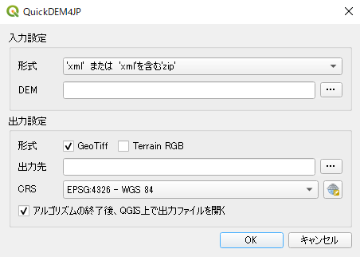

# QuickDEM4JP

## Overview

This is QGIS plugin to convert DEM XML files, provided by Geospatial Information Authority of Japan(GSI) to GeoTiff and Terrain RGB format.

You can get the DEM data in XML format for any location from the following site. https://fgd.gsi.go.jp/download

## Usage

- After install this plugin, you can choose below icon on QGIS toolbar.

- You should choose input type('xml'または'xml'を含む'zip' / 'xml'を含むフォルダ), input DEM path, output type(GeoTiff / Terrain RGB), output path and EPSG code of GeoTiff, then push OK.

