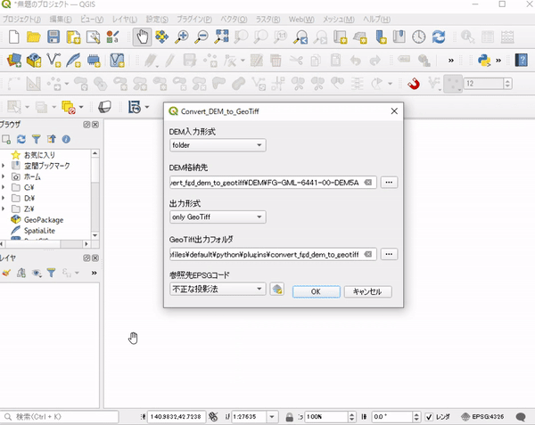
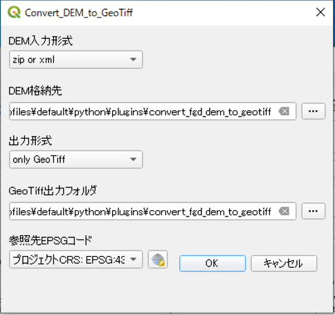

# convert_fgd_dem_to_geotiff

## Overview

This is QGIS plugin to convert DEM ("xml" or "folder containing .xml" or ".zip containing .xml") to GeoTiff and Terrain RGB (Tiff).

You can get the DEM data in xml format for any location from the following site. https://fgd.gsi.go.jp/download

## Usage

- After install this plugin, you can choose below icon on QGIS toolbar.

- You should choose input type(zip or xml / folder), input DEM path, output type(only GeoTiff / GeoTiff & Terrain RGB), output path and EPSG code of GeoTiff, then push OK.

