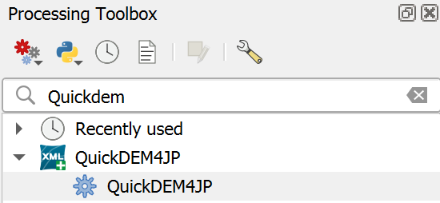

# QuickDEM4JP

[English](#Overview) / [日本語](#概要)

## Overview

This QGIS plugin converts DEM XML files from the Geospatial Information Authority of Japan (GSI) to GeoTIFF and Terrain RGB formats.

You can find the DEM data in XML format for any location on the following site: https://service.gsi.go.jp/kiban/app/map/?search=dem

## Usage

- The plugin will be added through the following icon to the plugin toolbar.

- You can also find it in the Processing Toolbox -> QuickDEM4JP.

- Select the input format, DEM path, output type (GeoTIFF or Terrain RGB), output path, and CRS. Check any options if needed, then click OK.

## 概要

このQGISプラグインは、国土地理院のDEM XMLファイルをGeoTIFFおよびTerrain RGB形式に変換する。

DEM XMLファイルは、以下のサイトからダウンロードできる。
https://service.gsi.go.jp/kiban/app/map/?search=dem

## 使い方

- プラグインは以下のアイコンはツールバーにも追加される。

- プロセッシングツールボックス -> QuickDEM4JPにも追加される。

- 入力先、出力形式、出力先とオプションなどを設定し、OKボタンを押して実行する。

