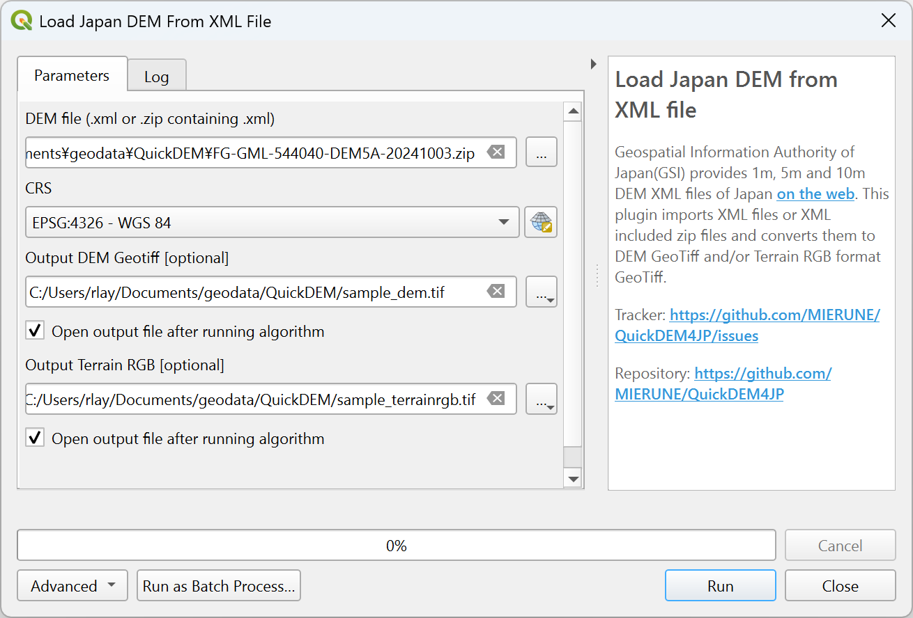

# QuickDEM4JP

[English](#Overview) / [日本語](#概要)

## Overview

This QGIS plugin converts DEM XML files from the Geospatial Information Authority of Japan (GSI) to GeoTIFF and Terrain RGB formats.

You can find the DEM data in XML format for any location on the following site: https://service.gsi.go.jp/kiban/app/map/?search=dem

## Usage

- The plugin is added to the plugin toolbar through the following icon.

- You can also find it in the Processing Toolbox -> QuickDEM4JP.

- Set the following parameters:
  - Input DEM data in XML file, or ZIP file containing XML files (required)
  - Output CRS (required)
  - Output DEM GeoTIFF file
  - Output Terrain RGB file
- Click OK to run.

## 概要

このQGISプラグインは、国土地理院のDEM XMLファイルをGeoTIFFおよびTerrain RGB形式に変換する。

DEM XMLファイルは、以下のサイトからダウンロードできる。
https://service.gsi.go.jp/kiban/app/map/?search=dem

## 使い方

- プラグインは以下のアイコンはツールバーに追加される。

- プロセッシングツールボックス -> QuickDEM4JPにも追加される。

- 以下のパラメータを設定
  - 入力DEMデータ：XMLファイル、またはXMLファイルを含むZIPファイル（必須）
  - 出力座標系（必須）
  - GeoTIFF形式の出力ファイル
  - Terrain RGBの出力ファイル
- 「OK」をクリックして実行

## Authors

- MIERUNE Inc.
- and all contributors