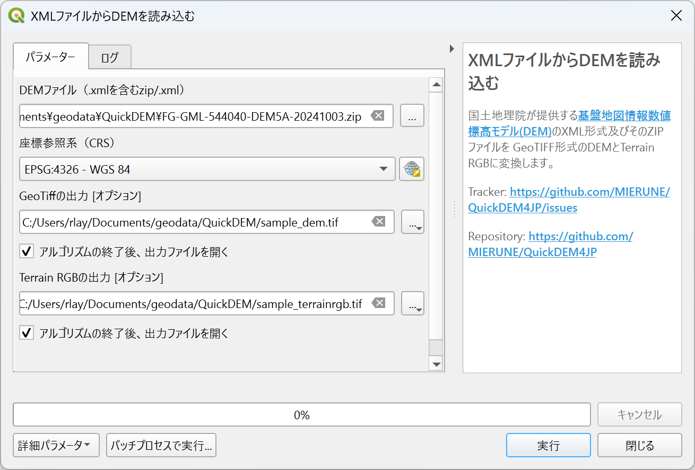

# QuickDEM4JP
[English](#Overview) / [日本語](#概要)

## Overview

This QGIS plugin converts DEM XML files from the Geospatial Information Authority of Japan (GSI) to GeoTIFF and Terrain RGB formats.

You can find the DEM data in XML format for any location on the following site: https://fgd.gsi.go.jp/download

## Usage

- The plugin will be added under Plugin -> QuickDEM4JP in the menu.
- You can also find this icon on the QGIS toolbar.

- Select the input format, DEM path, output type (GeoTIFF or Terrain RGB), output path, and CRS. Check any options if needed, then click OK.

## 概要

このQGISプラグインは、国土地理院のDEM XMLファイルをGeoTIFFおよびTerrain RGB形式に変換する。

DEM XMLファイルは、以下のサイトからダウンロードできる。
https://fgd.gsi.go.jp/download

## 使い方

- プラグインはメニューバーのプラグイン -> QuickDEM4JPに追加される。
- 以下のアイコンはツールバーにも表示される。

- 入力先、出力形式、出力先とオプションなどを設定し、OKボタンを押して実行する。

